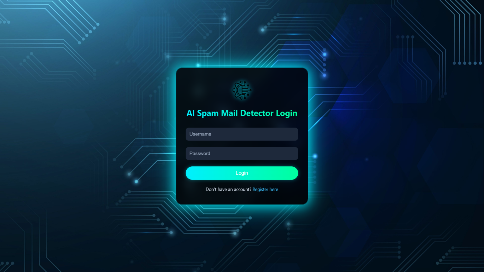
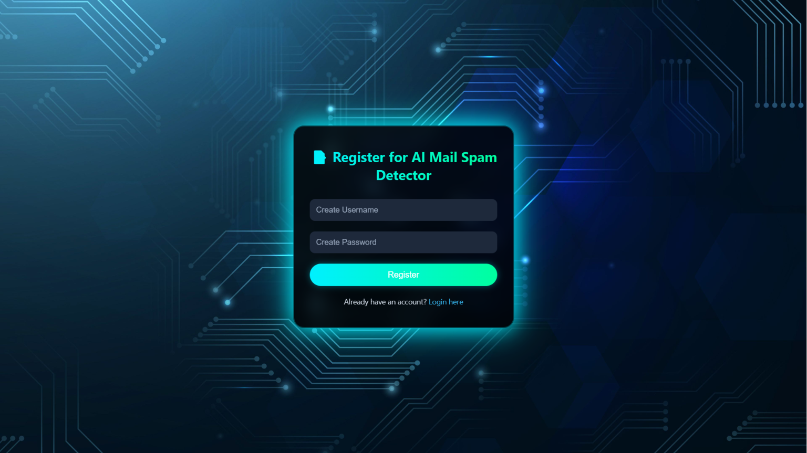
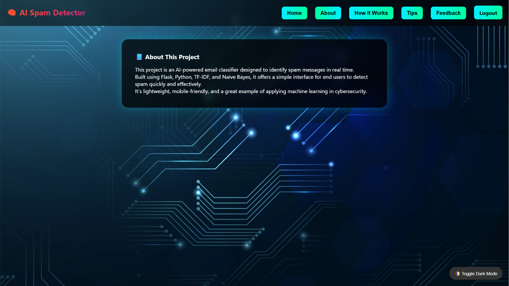
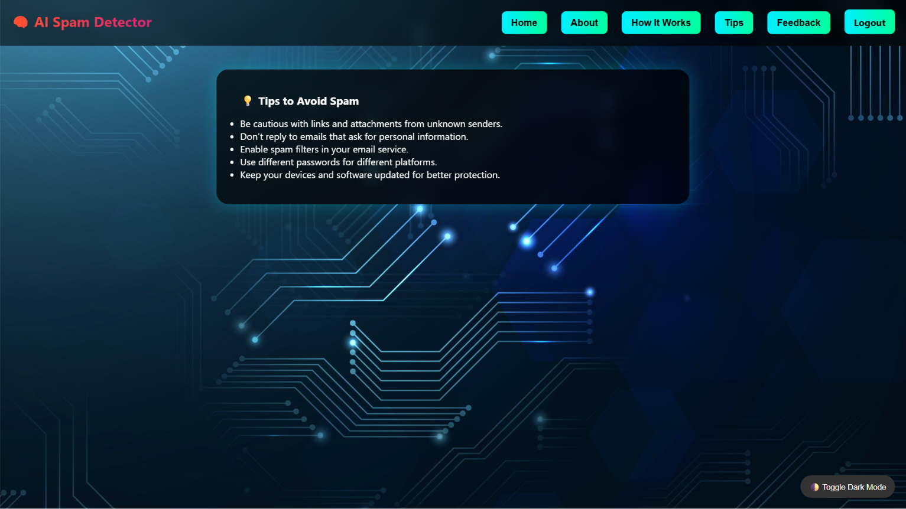

<div align="center">

<br />


<br />
<br />

# AI Spam Detector

**Classify emails and messages as spam or not spam — powered by Scikit-learn Machine Learning and Gmail integration**

<p>
  <a href="https://github.com/PriyankaChoudhary9877/ai-spam-detector">
    
  </a>
</p>

<p>
  
  
  
  
  
  
</p>

</div>

---

## Overview

AI Spam Detector is a Flask-based Machine Learning web application that classifies text messages and emails as **Spam** or **Not Spam** using a trained LinearSVC model with TF-IDF vectorization. The application includes Gmail inbox integration, user authentication, prediction history, feedback management, an admin dashboard, and cloud storage using Supabase PostgreSQL. It is deployed on Render for easy public access.

---

## Screenshots

<table>
  <tr>
    <td align="center" width="50%">
      <b>Home Dashboard</b><br /><br />
      
    </td>
    <td align="center" width="50%">
      <b>Spam Prediction</b><br /><br />
      
    </td>
  </tr>
  <tr>
    <td align="center" width="50%">
      <b>Gmail Inbox Integration</b><br /><br />
      
    </td>
    <td align="center" width="50%">
      <b>Admin Dashboard</b><br /><br />
      
    </td>
  </tr>
</table>

<details>
<summary><b>More Screenshots</b></summary>

<br />

**Authentication**

<table align="center">
  <tr>
    <td align="center"><b>Login</b><br /><br /></td>
    <td align="center"><b>Register</b><br /><br /></td>
  </tr>
</table>

<br />

**Prediction History**

<p align="center">
  
</p>

**Feedback Page**

<p align="center">
  
</p>

**How It Works**

<p align="center">
  
</p>

**About**

<p align="center">
  
</p>

**Dark Mode**

<p align="center">
  
</p>

**Tips**

<p align="center">
  
</p>

</details>

---

## Features

| Feature | Description |
|---|---|
| Machine Learning Spam Detection | Classifies any message as Spam or Not Spam using a trained model |
| LinearSVC Classifier | High-accuracy text classification powered by Scikit-learn |
| TF-IDF Vectorization | Converts raw text into numerical features for model input |
| Gmail Inbox Integration (Local Development Only) | Fetch and scan Gmail messages for spam in a local environment |
| User Authentication | Secure registration, login, and session management via Flask |
| Prediction History | View a full log of past predictions made by the user |
| CSV Download | Export prediction history as a CSV file |
| Feedback System | Users can submit feedback on prediction accuracy |
| Admin Dashboard | Manage users, view feedback, and monitor all predictions |
| Supabase PostgreSQL Database | All user data and prediction history stored securely in the cloud |
| Responsive Web Interface | Clean, accessible UI that works on desktop and mobile |
| Render Deployment | Hosted on Render for reliable public access |

---

## Tech Stack

<table>
  <tr>
    <td valign="top" width="25%">
      <b>Frontend</b><br /><br />
      <br />
      <br />
      <br />
      
    </td>
    <td valign="top" width="25%">
      <b>Backend</b><br /><br />
      <br />
      
    </td>
    <td valign="top" width="25%">
      <b>Machine Learning</b><br /><br />
      <br />
      <br />
      <br />
      
    </td>
    <td valign="top" width="25%">
      <b>Database</b><br /><br />
      <br />
      <br />
      
    </td>
  </tr>
  <tr>
    <td valign="top" width="25%">
      <b>Authentication</b><br /><br />
      <br />
      
    </td>
    <td valign="top" width="25%">
      <b>APIs</b><br /><br />
      
    </td>
    <td valign="top" width="25%">
      <b>Deployment</b><br /><br />
      
    </td>
    <td valign="top" width="25%">
      <b>Tools</b><br /><br />
      <br />
      
    </td>
  </tr>
</table>

---

## Getting Started

<details>
<summary><b>Prerequisites</b></summary>

<br />

- Python `3.10+`
- pip
- Git
- A Supabase project with PostgreSQL enabled
- Gmail API credentials (`credentials.json`)
- Google OAuth 2.0 credentials

</details>

<details open>
<summary><b>Installation</b></summary>

<br />

**1. Clone the repository**

```bash
git clone https://github.com/PriyankaChoudhary9877/ai-spam-detector.git
cd ai-spam-detector
```

**2. Create and activate a virtual environment**

```bash
python -m venv venv

# On macOS/Linux
source venv/bin/activate

# On Windows
venv\Scripts\activate
```

**3. Install dependencies**

```bash
pip install -r requirements.txt
```

**4. Configure environment variables**

Create a `.env` file in the root directory:

```env
SECRET_KEY=YOUR_SECRET_KEY
DB_HOST=YOUR_DB_HOST
DB_PORT=5432
DB_NAME=postgres
DB_USER=YOUR_DB_USER
DB_PASSWORD=YOUR_DB_PASSWORD
```

**5. Add Gmail API credentials**

Place your `credentials.json` file (downloaded from Google Cloud Console) in the root directory.

**6. Run the application**

```bash
python app.py
```

The application will be available at `http://127.0.0.1:5000`.

</details>

---

## Project Structure

```
ai-spam-detector/
│
├── app.py                     # Main Flask application
├── gmail_auth.py              # Gmail API authentication handler
├── spam_model.pkl             # Trained LinearSVC model
├── vectorizer.pkl             # Fitted TF-IDF vectorizer
├── credentials.json           # Gmail API credentials (not committed)
├── requirements.txt
├── README.md
│
├── templates/                 # Jinja2 HTML templates
│
└── static/                    # CSS, JS, and static assets
```

> **Note:** The following files and folders should be added to `.gitignore` and never committed to the repository:
> ```
> .env
> credentials.json
> token.json
> .venv/
> __pycache__/
> *.pyc
> ```

---

## Roadmap

Features planned for future releases:

- Real-time Email Spam Detection
- Multiple Machine Learning Models
- Deep Learning Based Classification
- Email Attachment Analysis
- Batch Email Spam Detection
- Email Classification Statistics
- User Profile Management
- Analytics Dashboard
- Dark Mode
- Multi-language Support
- Docker Deployment
- CI/CD Pipeline

---

## Author

<table>
  <tr>
    <td align="center">
      <b>Priyanka Choudhary</b><br />
      Computer Science Engineering Student<br /><br />
      <a href="https://github.com/PriyankaChoudhary9877">
        
      </a>
      &nbsp;
      <a href="https://www.linkedin.com/in/priyanka-choudhary-58b048312/">
        
      </a>
      &nbsp;
      <a href="mailto:priyankachoudhary9877@gmail.com">
        
      </a>
    </td>
  </tr>
</table>

---

<div align="center">

⭐ If you found this project useful, please consider giving it a star on GitHub.

<br />

Designed and developed by Priyanka Choudhary.

</div>
